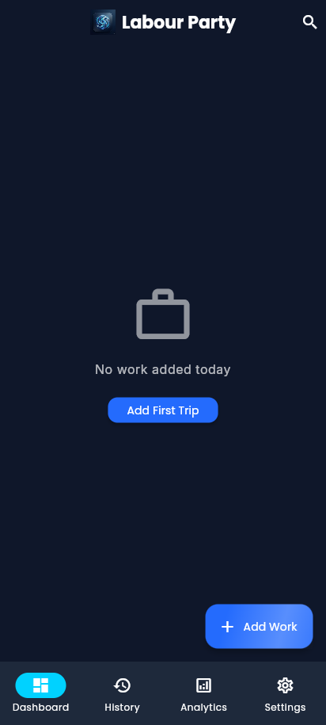
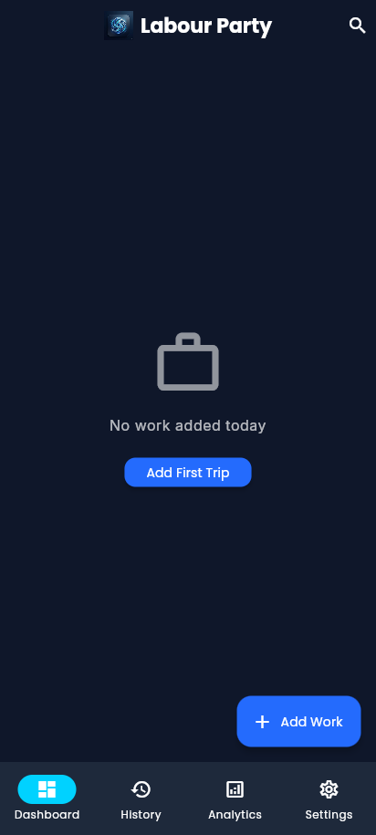
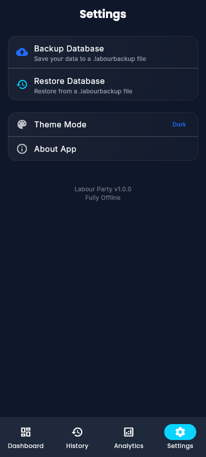
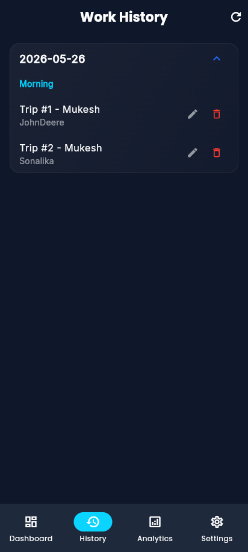
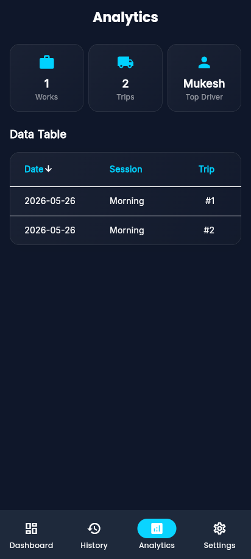
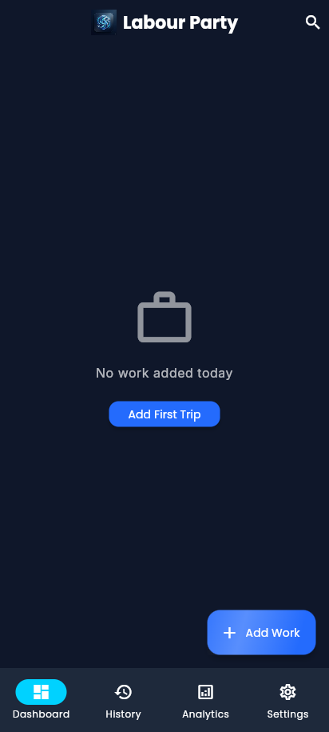

# Application Screenshots Gallery

| Dashboard (Active Work) | Trip Details | Confirm Next Trip |
| :---: | :---: | :---: |
|    *Real-time tracking of active daily session runs.* |    *Deep-dive metrics and explicit labour assignment view.* |    *Sequential append-flow with deep copied configuration bounds.* |

| Add/Edit Work | History | Analytics |
| :---: | :---: | :---: |
|    *Offline-first form capturing parameters with auto-save.* |    *Chronological offline storage of grouped datasets.* |    *Real-time local aggregations based entirely on Hive payloads.* |

| Search & Filters | Backup & Restore | Settings |
| :---: | :---: | :---: |
|    *Memory-bound fast local filtering.* |    *Scoped-storage manual export payload workflows.* |    *Application configurations.* |
